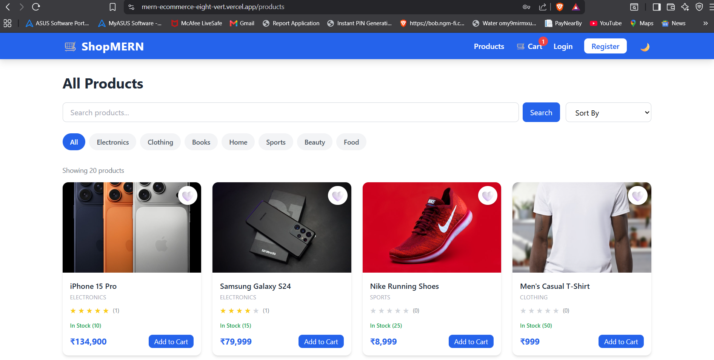
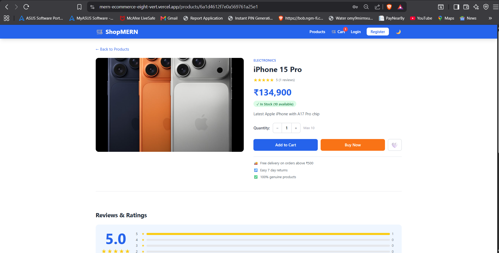
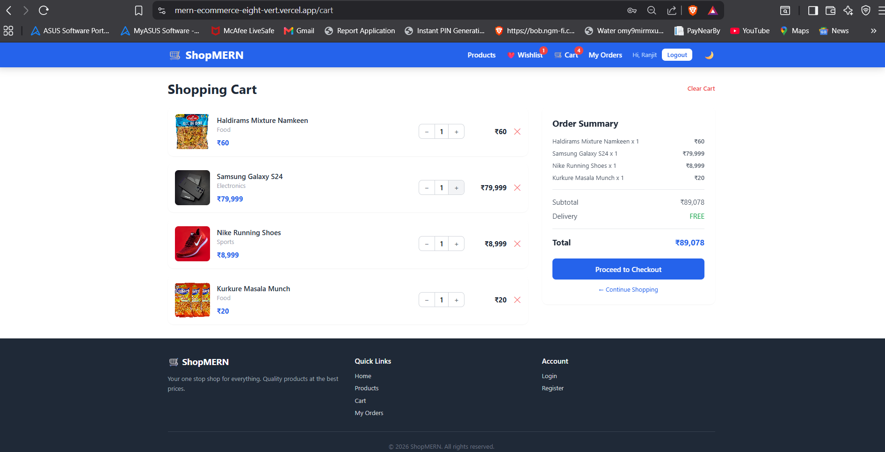
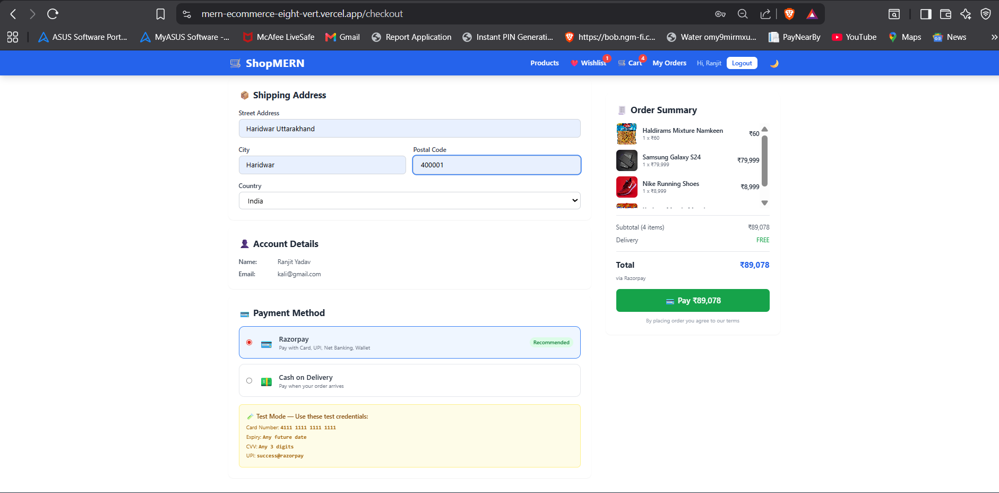
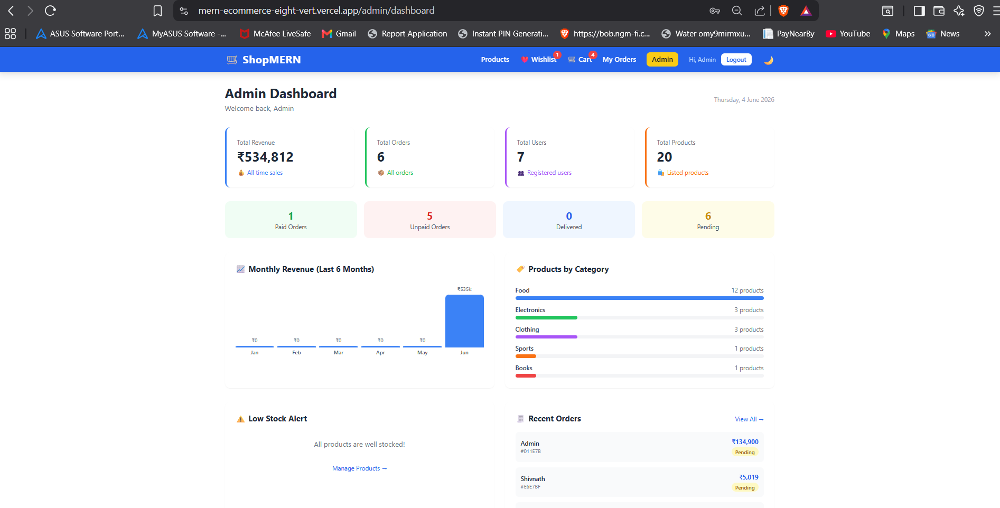
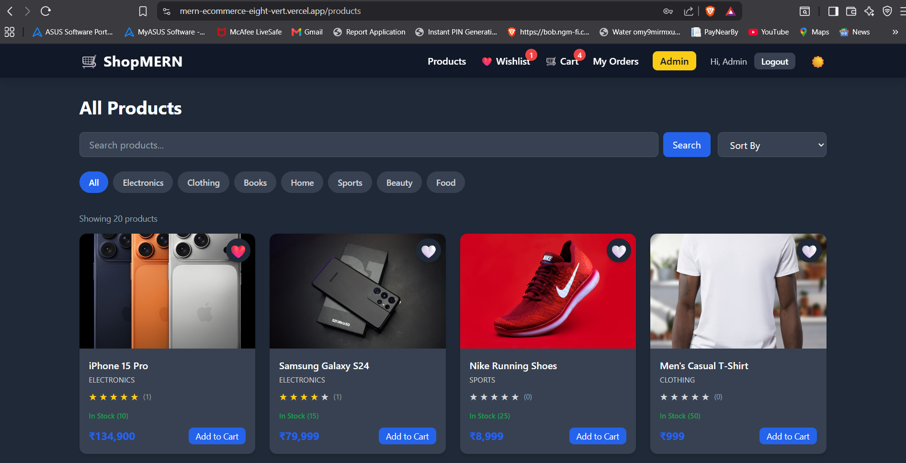

<div align="center">

# ShopMERN

### A production-ready full-stack e-commerce platform built with the MERN stack

[](https://mern-ecommerce-eight-vert.vercel.app)
[](https://mern-ecommerce-backend-qwsw.onrender.com)
[](https://github.com/YOUR_USERNAME/mern-ecommerce)


</div>

---

## Overview

ShopMERN is a fully functional e-commerce web application designed with real-world architecture in mind. It covers the complete shopping lifecycle — from product discovery to order fulfillment — with a dedicated admin panel for business management.

Built as a demonstration of full-stack engineering capability, the project integrates industry-standard tools including JWT-based authentication, Cloudinary for media management, Razorpay for payment processing, and a responsive UI powered by Tailwind CSS.

---

## Key Highlights

- 🔐 Secure JWT authentication with role-based access control
- 💳 Real payment processing via Razorpay (Cards, Net Banking)
- ☁️ Cloud image management with Cloudinary CDN
- 📊 Admin analytics dashboard with revenue and order insights
- 🌙 Dark mode with persistent user preference
- ❤️ Wishlist, Reviews & Ratings system
- 📱 Fully responsive across all screen sizes
- 🚀 Deployed on Vercel + Render with MongoDB Atlas

---

## Features

### Customer
- Register, login, and manage account
- Browse, search, filter and sort products by category and price
- Product detail page with image gallery, ratings and reviews
- Add to cart with quantity management
- Save products to wishlist
- Checkout with shipping address
- Pay via Razorpay (Card,Net Banking, Wallet) or Cash on Delivery
- View order history and track order status

### Admin
- Full product management — create, edit, delete with image upload
- Order management — view all orders, mark as delivered
- User management — view all registered users
- Analytics dashboard — revenue, order stats, monthly chart, low stock alerts

### General
- Dark / Light mode toggle
- Persistent cart and wishlist
- Loading states and error handling throughout
- Mobile-friendly responsive design

---

## Tech Stack

| Layer | Technology | Purpose |
|---|---|---|
| Frontend | React.js + Vite | UI framework with fast build tooling |
| Routing | React Router DOM | Client-side navigation |
| Styling | Tailwind CSS | Utility-first responsive design |
| HTTP | Axios | API communication with interceptors |
| State | Context API | Global auth, cart, wishlist, theme state |
| Backend | Node.js + Express.js | REST API server |
| Database | MongoDB Atlas + Mongoose | Cloud NoSQL database with ODM |
| Auth | JSON Web Tokens + Bcrypt | Secure authentication and password hashing |
| Payments | Razorpay | Indian payment gateway integration |
| Media | Cloudinary + Multer | Cloud image upload and delivery |
| Hosting | Vercel + Render | Frontend and backend deployment |

---

## Architecture

┌─────────────────────────────────────────────────┐
│                   Client (Vercel)                │
│                                                  │
│   React + Vite + Tailwind + Context API          │
│                                                  │
│   Pages → Components → API Layer → Axios         │
└──────────────────────┬──────────────────────────┘
│ HTTPS REST API
┌──────────────────────▼──────────────────────────┐
│                  Server (Render)                 │
│                                                  │
│   Express.js → Routes → Controllers              │
│   Middleware (JWT Auth, Admin Check)             │
│   Cloudinary (Images) + Razorpay (Payments)      │
└──────────────────────┬──────────────────────────┘
│ Mongoose ODM
┌──────────────────────▼──────────────────────────┐
│              Database (MongoDB Atlas)            │
│                                                  │
│   Collections: Users, Products, Orders,          │
│   Wishlist                                       │
└─────────────────────────────────────────────────┘

---

## API Reference

### Authentication
| Method | Endpoint | Description | Access |
|---|---|---|---|
| POST | `/api/auth/register` | Register new user | Public |
| POST | `/api/auth/login` | Login and get token | Public |

### Products
| Method | Endpoint | Description | Access |
|---|---|---|---|
| GET | `/api/products` | Get all products with filters | Public |
| GET | `/api/products/:id` | Get single product | Public |
| POST | `/api/products` | Create product | Admin |
| PUT | `/api/products/:id` | Update product | Admin |
| DELETE | `/api/products/:id` | Delete product | Admin |

### Orders
| Method | Endpoint | Description | Access |
|---|---|---|---|
| POST | `/api/orders` | Place new order | User |
| GET | `/api/orders/myorders` | Get user orders | User |
| GET | `/api/orders` | Get all orders | Admin |
| PUT | `/api/orders/:id/pay` | Mark as paid | User |
| PUT | `/api/orders/:id/deliver` | Mark as delivered | Admin |

### Reviews
| Method | Endpoint | Description | Access |
|---|---|---|---|
| GET | `/api/products/:id/reviews` | Get product reviews | Public |
| POST | `/api/products/:id/reviews` | Add review | User |
| DELETE | `/api/products/:id/reviews/:reviewId` | Delete review | User/Admin |

### Wishlist
| Method | Endpoint | Description | Access |
|---|---|---|---|
| GET | `/api/wishlist` | Get wishlist | User |
| POST | `/api/wishlist` | Add to wishlist | User |
| DELETE | `/api/wishlist/:productId` | Remove item | User |

### Payment
| Method | Endpoint | Description | Access |
|---|---|---|---|
| GET | `/api/payment/key` | Get Razorpay key | User |
| POST | `/api/payment/create-order` | Create payment order | User |
| POST | `/api/payment/verify` | Verify payment signature | User |

### Admin
| Method | Endpoint | Description | Access |
|---|---|---|---|
| GET | `/api/analytics` | Dashboard stats | Admin |
| GET | `/api/users` | All users | Admin |
| POST | `/api/upload` | Upload image | Admin |

---

## Screenshots

<details>
<summary>View Screenshots</summary>

### Home Page


### Product Listing


### Product Detail


### Shopping Cart


### Checkout & Payment


### Admin Dashboard


### Dark Mode


</details>

---

## Getting Started

### Prerequisites

Node.js >= 18.0.0
MongoDB Atlas account
Cloudinary account
Razorpay account (test mode)

### Clone & Install

```bash
# Clone the repository
git clone https://github.com/YOUR_USERNAME/mern-ecommerce.git
cd mern-ecommerce
```

### Backend Setup

```bash
cd server
npm install
```

Create `server/.env`:
```env
PORT=5000
MONGO_URI=your_mongodb_connection_string
JWT_SECRET=your_jwt_secret_key
FRONTEND_URL=http://localhost:5173
CLOUDINARY_CLOUD_NAME=your_cloud_name
CLOUDINARY_API_KEY=your_api_key
CLOUDINARY_API_SECRET=your_api_secret
RAZORPAY_KEY_ID=rzp_test_your_key_id
RAZORPAY_KEY_SECRET=your_key_secret
```

```bash
npm run dev
# Server running at http://localhost:5000
```

### Frontend Setup

```bash
cd client
npm install
```

Create `client/.env`:
```env
VITE_API_URL=http://localhost:5000/api
```

```bash
npm run dev
# App running at http://localhost:5173
```

---

## Deployment

| Service | Platform | URL |
|---|---|---|
| Frontend | Vercel | https://mern-ecommerce-eight-vert.vercel.app |
| Backend | Render | https://mern-ecommerce-backend-qwsw.onrender.com |
| Database | MongoDB Atlas | Cloud hosted |
| Images | Cloudinary | CDN delivered |

> **Note:** Render free tier may take 30-60 seconds to wake up on first request after inactivity.

---

## Test Credentials
---
Admin

Email    → admin@gmail.com
Password → admin123
---

## Project Structure

mern-ecommerce/
│
├── client/                   # React frontend
│   ├── src/
│   │   ├── api/              # Axios instance + endpoints
│   │   ├── components/       # Reusable UI components
│   │   ├── context/          # Auth, Cart, Theme, Wishlist
│   │   ├── hooks/            # Custom hooks (useRazorpay)
│   │   └── pages/            # Route-level page components
│   │       └── admin/        # Admin-only pages
│   └── vercel.json           # Vercel routing config
│
└── server/                   # Express backend
├── config/               # DB + Cloudinary config
├── controllers/          # Business logic
├── middleware/            # Auth + Admin guards
├── models/               # Mongoose schemas
└── routes/               # API route definitions

---

## Future Scope

- [ ] Email notifications on order placement and delivery
- [ ] Coupon and discount code system
- [ ] Product comparison feature
- [ ] Advanced search with Elasticsearch
- [ ] PWA support for mobile app experience
- [ ] Multi-vendor marketplace support
- [ ] Inventory management with low stock alerts via email
- [ ] Docker containerization for easier deployment

---

## Author

<div align="center">

**Ranjit Yadav**

Full Stack Developer

[](https://www.linkedin.com/in/ranjit-yadav-77974921b/)
[](https://github.com/Ranjit2000)
[](https://ranjityadav-portfolio.netlify.app/)

</div>

---

<div align="center">

Built with ❤️ using the MERN Stack

⭐ Star this repo if you found it helpful

</div>